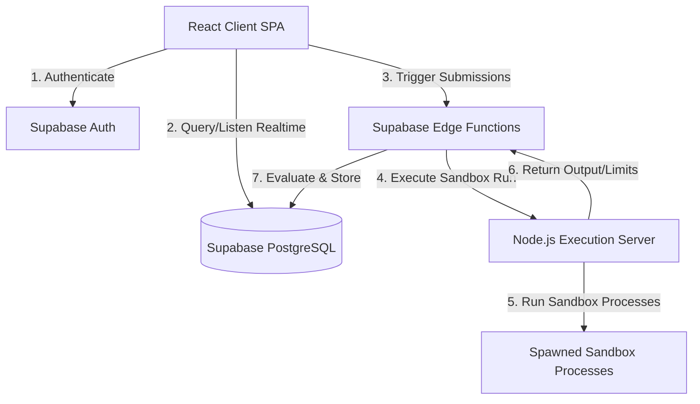

# TraceCode Architecture Specification

This document details the system design, components, security parameters, database policies, and network communication topologies for **TraceCode v1.0**.

---

## 1. High-Level Component Topology

TraceCode is built on a decoupled, secure, and real-time multi-tier architecture designed to run untrusted code while maintaining zero client visibility into assessment test cases.



---

## 2. Component Directory

### A. React Single Page Application (Client)
* **Technology**: React 18, Vite (SWC), TypeScript, Tailwind CSS, Zustand, Monaco Editor, XTerm.js, Recharts.
* **Responsibilities**: High-performance editor environment, console rendering, real-time live proctoring telemetry feeds, classroom dashboards, and leaderboard display.

### B. Supabase Edge Functions (Deno Runtime)
* **Functions**:
  * `evaluate-submission-tests`: Orchestrates sandbox executions, runs normalized whitespace assertions, computes cp-verdicts, and triggers async reviews.
  * `check-plagiarism`: Conducts background code-similarity scans using Winnowing/cosine metrics.
  * `detect-fraud`: Real-time behavioral anomaly logs analysis (copy-pastes, time elapsed).
* **Security Context**: Executes under the secure PostgreSQL Service Role, avoiding user-context security token bypasses.

### C. Node.js Execution Server (Sandboxed Code Runner)
* **Technology**: Node.js, Express, Socket.IO, `pidusage` resource monitors.
* **Responsibilities**: Receives code payloads, compiles if required (C++, C, Java), streams bi-directional standard inputs/outputs over sockets, and enforces tight system quotas.

---

## 3. Sandboxing & Limits Enforcements

Every execution run inside the sandbox runs under strict bounds:

| Limit Parameter | Default Value | Mitigation Trigger |
| :--- | :--- | :--- |
| **CPU Time Limit** | 5.0 seconds | Evaluates CPU seconds, kills process on exceed. |
| **Memory Limit** | 256 MB | Monitored every 100ms via `pidusage`, triggers SIGKILL. |
| **Wall Clock Limit** | 30.0 seconds | Absolute backup timeout to clear zombie scripts. |
| **Output Buffer Limit** | 5 MB | Truncates stdout/stderr stream blocks to prevent buffer overflows. |
| **Request Rate Limit** | 20 runs/minute | Protects compiler from resource exhaustion. |

---

## 4. Row Level Security (RLS) & Hidden Test Case Safety

To prevent test-case leakage, TraceCode uses PostgreSQL Row Level Security.

```sql
-- Students can only read non-hidden test cases
CREATE POLICY "SELECT test cases" ON public.test_cases
  FOR SELECT TO authenticated
  USING (
    (
      NOT is_hidden
      AND EXISTS (
        SELECT 1 FROM public.assignments a
        WHERE a.id = assignment_id
        AND (
          a.classroom_id IS NULL
          OR a.created_by = auth.uid()
          OR public.user_enrolled_in_classroom(a.classroom_id)
        )
      )
    )
    OR EXISTS (
      SELECT 1 FROM public.assignments a
      WHERE a.id = assignment_id
      AND a.created_by = auth.uid()
    )
  );
```

> [!IMPORTANT]
> The database select policy explicitly enforces `NOT is_hidden` for student sessions. Hidden test cases are never returned via public Supabase API hooks, and are loaded exclusively in Deno Edge Functions using the private Service Role Key.
