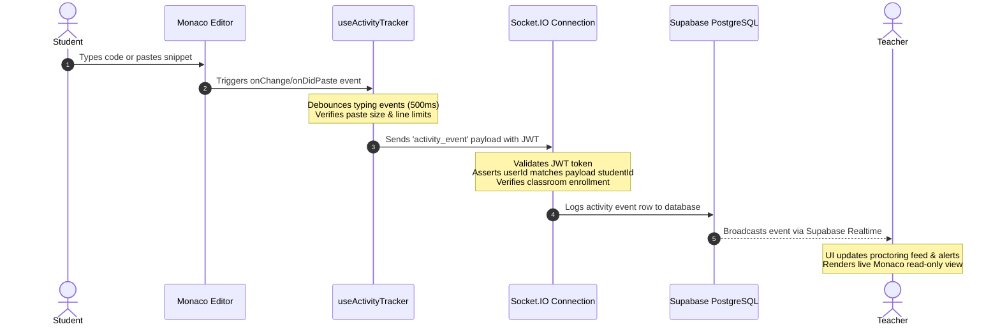
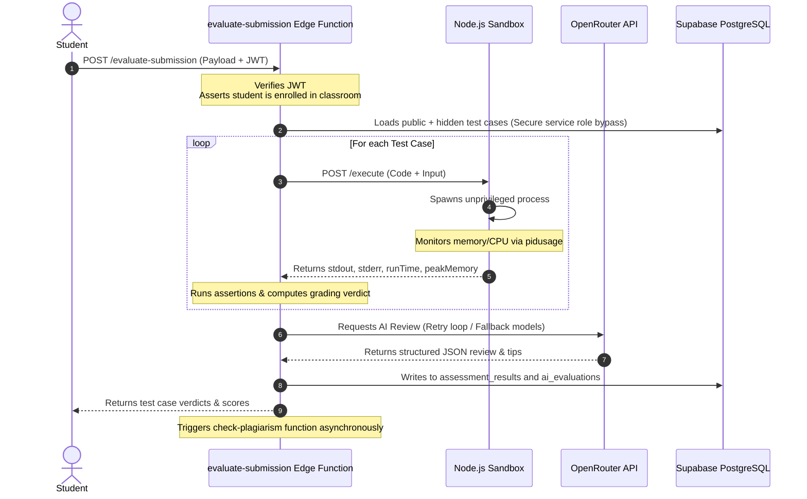
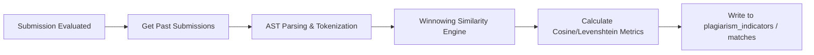

# TraceCode System Architecture & Technical Specification

This document details the system design, components, security boundaries, database RLS policies, and real-time execution pipelines for **TraceCode v1.0**.

---

## 1. High-Level System Architecture

TraceCode is built on a decoupled, secure, and real-time multi-tier architecture. It separates client-side interactions, database persistence, edge computation, AI feedback, and sandboxed code execution to ensure robust security and scalability.

```mermaid
graph TB
    subgraph Client Tier (PWA)
        Client[React Client SPA]
        Monaco[Monaco Editor]
        Terminal[xterm.js Console]
    end

    subgraph Authentication & Gateway
        SupaAuth[Supabase Auth]
        SocketIOAuth[Socket.IO Token Validator]
    end

    subgraph Backend Services
        SupaDB[(Supabase PostgreSQL)]
        SupaEdge[Supabase Edge Functions]
        ExecServer[Node.js Execution Server]
    end

    subgraph External APIs
        OpenRouter[OpenRouter AI Platform]
    end

    %% Client Interactions
    Client -->|1. Authenticate / Retrieve JWT| SupaAuth
    Client -->|2. Query / Listen via RLS| SupaDB
    Client -->|3. Establish Bi-directional Channel| ExecServer
    Client -->|4. Submit Assignment| SupaEdge

    %% Execution & Validation
    SupaEdge -->|5. Run Sandboxed Test Cases| ExecServer
    ExecServer -->|6. Spawns Unprivileged Process| SandProcess[Isolated Node/Python Run]
    SupaEdge -->|7. Query LLM Evaluator| OpenRouter
    SupaEdge -->|8. Persist Score & Feedback| SupaDB
```

---

## 2. Tech Stack Overview

### Frontend Client (Single Page Application)
* **Core**: React 18, Vite (SWC compiler), TypeScript, Tailwind CSS, `next-themes`.
* **State & Caching**: Zustand (Local store/persistence), TanStack React Query v5 (Server cache).
* **IDE Elements**: Monaco Editor (`@monaco-editor/react`) for code editing, `xterm.js` for bi-directional streaming interactive console, `react-resizable-panels` for drag-and-drop workspaces.
* **Telemetry**: Native Monaco event listeners for paste monitoring, activity tracking hooks, Socket.IO client.
* **PWA Utilities**: `vite-plugin-pwa` for service worker generation, offline network guards, update triggers.

### Backend & Edge Infrastructure
* **Supabase Gateway**: 
  * PostgreSQL database storing classrooms, assignments, submissions, telemetry, and proctoring metrics.
  * Supabase Realtime for instant classroom log broadcasts.
  * Supabase Auth providing JWT validation.
* **Deno Edge Functions**:
  * `evaluate-submission`: Validates role, executes code via sandbox, updates grades, queries OpenRouter, and invokes similarity analysis.
  * `check-plagiarism`: Conducts AST structural matching and peer similarity scans.
  * `detect-fraud`: Aggregates behavioral logs (typing speed, massive copy-pastes, time elapsed).
* **Node.js Sandbox Execution Server**:
  * Node.js, Express, Socket.IO.
  * Handles code execution via isolated child process forks.
  * Real-time metrics computed via `pidusage` for RAM/CPU throttling.

---

## 3. Realtime Telemetry & Monitoring Flow

To protect exam integrity, the Student Workspace logs keystrokes, runtime runs, and clipboard pastes. This data is debounced client-side to prevent socket pollution, verified server-side to prevent student ID spoofing, and broadcasted to the Teacher Proctoring Panel in real-time.



---

## 4. AI Evaluation Flow

When a student submits an assignment, the scoring system runs the code against public and hidden test cases, computes test metrics, calls OpenRouter AI for styling and design advice, and persists feedback.



### OpenRouter Retry & Fallback Architecture
* **Inference Endpoint**: `https://openrouter.ai/api/v1/chat/completions`
* **Model Hierarchy**: 
  1. `openai/gpt-oss-20b:free` (Primary model)
  2. `qwen/qwen3-32b:free` (Fallback 1)
  3. `deepseek/deepseek-r1:free` (Fallback 2)
* **Timeout & Retry Settings**: 30-second request timeout. Auto-retries up to 3 times per model with exponential backoff on 429 rate-limits or 5xx server failures before falling back to the next model in the chain.

---

## 5. Plagiarism Detection Flow

Plagiarism detection executes as an asynchronous pipeline triggered immediately after code evaluation.



* **Winnowing Algorithm**: Extracts structural k-grams from the source code, hashes them, selects a subset of hashes using a sliding window algorithm, and compares document fingerprints. This ignores whitespace, variable renamings, and comments.
* **Match thresholds**: 
  * Under 30%: Low risk (Normal)
  * 30% - 70%: Medium risk (Warning)
  * Over 70%: High risk (Critical similarity alert flagged in proctoring board)

---

## 6. PWA Caching & Offline Capabilities

TraceCode integrates Progressive Web App configurations via service worker caching strategies using Workbox.

### Service Worker Caching Strategy
* **Pre-cached Assets**: Static HTML shell, CSS sheets, icons, Monaco Editor chunks, and routing bundles are pre-cached on installation.
* **NetworkOnly Exclusions**:
  * Real-time sockets (`socket.io/*`)
  * Database REST endpoints (`*.supabase.co/rest/*`)
  * Auth routes (`*.supabase.co/auth/*`)
  * Edge Functions (`*.supabase.co/functions/*`)
  * OpenRouter API completions (`openrouter.ai`)
* **Offline Fallbacks**: If the connection is lost, a floating offline alert is triggered, disabling code compilation, telemetry updates, and AI queries.

---

## 7. Security Architecture

### Role-Based Access Control (RBAC)
TraceCode enforces boundaries across the entire stack:
1. **Frontend Guards**: `ProtectedRoute` checks local Auth state and blocks route access based on role (`student`, `teacher`, `admin`).
2. **API & Edge Function Verification**: Custom middlewares parse authorization headers (`Bearer JWT`) to confirm the user's role and classroom enrollment before serving queries.
3. **WebSocket Connect Check**: Socket.IO connections enforce token handshakes, verifying the client's Supabase JWT before binding socket channels.

### Row Level Security (RLS) Database Schema
* **`assignments`**: Teachers have full access. Students can read only if they are enrolled in the assignment's classroom.
* **`test_cases`**:
  * Public test cases (`is_hidden = false`) are readable by enrolled students.
  * Hidden test cases (`is_hidden = true`) are blocked from SELECT queries for student tokens. They are accessed exclusively by Supabase Edge Functions using database service role bypasses.
* **`ai_evaluations`**: Direct insert is disabled for students. Selected records are only visible to the assignment owner (teacher) or the student (only if `results_visible = true` is set on the assignment).
* **`activity_events`**: Read access is restricted to the classroom's teacher or the student who created the event.

### Secure Classroom Enrollment RPC
Direct table inserts into `classroom_students` are locked. Classroom joins must be initiated through a PostgreSQL Security Definer function (`join_classroom(classroom_code)`). The function verifies classroom validity, matches the current authenticated user's ID, and securely writes the enrollment.
